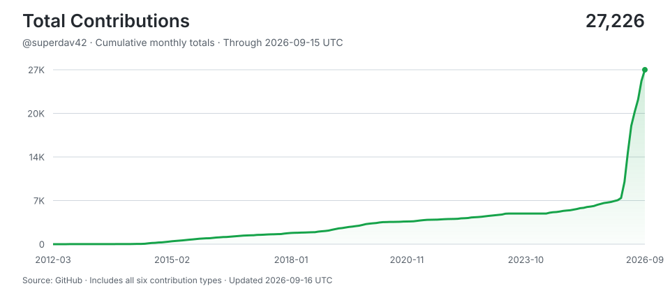

# David Stone

**Worked at @automattic on  @woocommerce . Now I revive the awesome open source project Ultimate Multisite.**

> Shipping with AI agents around the clock -- human hours for thinking, machine hours for doing.
> Stats auto-updated by [aidevops](https://aidevops.sh).

<!-- STATS-START -->
## Work with AI

| Metric | Yesterday | Prior 7 Days | Prior 28 Days | Prior 365 Days |
| --- | ---: | ---: | ---: | ---: |
| Screen time (Linux) | 6.5h | 46.4h | 197.1h | ~4520h* |
| Interactive human attention | 3.5h | 39.3h | 131.5h | 187.8h |
| Interactive AI generation | 10.6h | 163.2h | 474.8h | 656.5h |
| Worker-classified human attention | 0.3h | 40.5h | 145.4h | 145.7h |
| Worker/headless AI generation | 4.2h | 46.3h | 130.2h | 417.2h |
| Additive observed work | 18.4h | 278.7h | 854.6h | 1,379.7h |
| Interactive sessions | 91 | 405 | 1,437 | 1,994 |
| Worker sessions | 163 | 859 | 3,246 | 6,282 |

_Screen time from screen-time-history:daily-observations; collection status: ok. *365-day estimate uses observed calendar coverage._

_Periods are completed local calendar days ending at midnight; today is excluded._

_Human attention is unioned wall-clock time, so overlapping sessions are not double-counted. AI generation is additive machine work across sessions; it is not wall-clock concurrency._

_AI session 365-day totals cover 61 days of local assistant session history (not extrapolated)._

## AI Model Usage (last 30 days)

| Model | Requests | Input | Output | Cache read | Cache Hit-Rate % | Session Count | Session Hours |
| --- | ---: | ---: | ---: | ---: | ---: | ---: | ---: |
| gpt-5.6-sol | 61,706 | 366.8M | 13.9M | 7,871.0M | 95.5% | 377 | 486.8h |
| gpt-5.6-terra | 21,987 | 262.0M | 5.4M | 1,572.2M | 85.7% | 1,882 | 118.1h |
| gpt-5.5 | 3,120 | 12.6M | 580K | 142.5M | 91.9% | 124 | 16.4h |
| gpt-5.6-luna | 2,354 | 23.1M | 111K | 17.1M | 42.6% | 2,223 | 5.5h |
| gpt-6-astra | 299 | 697K | 86K | 47.1M | 98.5% | 4 | 3.0h |
| **Total** | **89,466** | **665.3M** | **20.2M** | **9,650.1M** | **93.5%** | **4,589** | **629.7h** |

_10,335.7M total tokens processed. 93.5% cache hit rate._

## AI Model Usage (all time)

| Model | Requests | Input | Output | Cache read | Cache Hit-Rate % | Session Count | Session Hours |
| --- | ---: | ---: | ---: | ---: | ---: | ---: | ---: |
| gpt-5.6-sol | 88,978 | 525.1M | 20.5M | 11,129.7M | 95.5% | 690 | 656.6h |
| gpt-5.6-terra | 42,457 | 395.3M | 11.0M | 3,692.1M | 90.3% | 2,948 | 238.5h |
| gpt-5.5 | 34,507 | 161.0M | 8.3M | 2,290.8M | 93.4% | 1,283 | 155.4h |
| gpt-5.6-luna | 3,138 | 30.0M | 180K | 53.4M | 64.0% | 2,652 | 7.6h |
| claude-sonnet-4-6 | 481 | 0 | 0 | 0 | 0.0% | 481 | 2.2h |
| gpt-6-astra | 299 | 697K | 86K | 47.1M | 98.5% | 4 | 3.0h |
| qwen3.6-100k:latest | 102 | 5.4M | 46K | 0 | 0.0% | 2 | 2.4h |
| gpt-5.3-codex-spark | 49 | 75K | 3K | 1.7M | 95.9% | 1 | 0.5h |
| gpt-5.4-mini | 5 | 65K | 270 | 0 | 0.0% | 5 | 0.0h |
| gpt-5.6 | 2 | 0 | 0 | 0 | 0.0% | 2 | 0.0h |
| **Total** | **170,018** | **1,117.9M** | **40.2M** | **17,215.1M** | **93.9%** | **8,026** | **1,066.2h** |

_18,373.4M total tokens processed. 93.9% cache hit rate._
<!-- STATS-END -->

## Projects
- **[Ultimate Multisite](https://github.com/ultimate-multisite/ultimate-multisite)** -- The Website as a Service plugin for WordPress Multisite.
- **[wp-update-server-plugin](https://github.com/superdav42/wp-update-server-plugin)** -- Enable automatic updates for WordPress plugins sold as Woocommerce downloadable products
- **[meeting-manager](https://github.com/superdav42/meeting-manager)** -- WordPress block for managing virtual meetings with Jitsi/JaaS integration, scheduling, and notifications
- **[glotpress-rest-api](https://github.com/superdav42/glotpress-rest-api)** -- Adds REST API endpoints for GlotPress project management
- **[magento-image-usage-calculator](https://github.com/superdav42/magento-image-usage-calculator)** -- Usage calculator to make it possible to purchase images or artwork at various resolutions.
- **[do-test](https://github.com/superdav42/do-test)** -- No description
- **[magento-image-products](https://github.com/superdav42/magento-image-products)** -- New product type for Magento 2 which makes it easy to sell images, photographs and artwork.
- **[magento-image-quality](https://github.com/superdav42/magento-image-quality)** -- Improve image quality of product images in Magento 2
- **[kalidokit-react](https://github.com/superdav42/kalidokit-react)** -- Kalidokit example using react and three js fiber
- **[gutenberg-standalone](https://github.com/superdav42/gutenberg-standalone)** -- Gutenberg without WordPress
- **[perf-html-editor](https://github.com/superdav42/perf-html-editor)** -- Created with CodeSandbox
- **[php-pm-wordpress](https://github.com/superdav42/php-pm-wordpress)** -- Experimental way to run WordPress with the PHP Process Manager
- **[psp](https://github.com/superdav42/psp)** -- Sample wordpress install with bedrock and moodle
- **[gp-reject-feedback](https://github.com/superdav42/gp-reject-feedback)** -- Plugin for GlotPress which allow reviewers to provide feedback for translators
- **[TwigOptimizations](https://github.com/superdav42/TwigOptimizations)** -- Twig extensions which enable some experimental optimizations on compiled code
- **[datauri-pages](https://github.com/superdav42/datauri-pages)** -- pages
## Contributions

- **[docket-cache](https://github.com/nawawi/docket-cache)** -- A persistent object cache stored as a plain PHP code, accelerates caching with OPcache backend.
- **[jetpack](https://github.com/Automattic/jetpack)** -- Security, performance, marketing, and design tools — Jetpack is made by WordPress experts to make WP sites safer and faster, and help you grow your traffic.
- **[GlotPress-WP](https://github.com/GlotPress/GlotPress)** -- :earth_africa: :earth_americas: :earth_asia: GlotPress, a WordPress Plugin
- **[datatable-translatable](https://github.com/unfoldingWord/datatable-translatable)** -- A Component Library for Translating DataTables using React and MaterialUI.
- **[wp-sqlite-db](https://github.com/aaemnnosttv/wp-sqlite-db)** -- A single file drop-in for using a SQLite database with WordPress. Based on the original SQLite Integration plugin.
- **[claude-max-api-proxy](https://github.com/atalovesyou/claude-max-api-proxy)** -- Use your Claude Max/Pro subscription with any OpenAI-compatible client. Saves $1000s compared to API keys.
- **[WPTranslationFiller](https://github.com/vibgyj/WPTranslationFiller)** -- No description
- **[wbwwb](https://github.com/ncase/wbwwb)** -- We Become What We Behold – a minigame about the news!
- **[action-scheduler](https://github.com/woocommerce/action-scheduler)** -- A scalable, traceable job queue for background processing large queues of tasks in WordPress. Specifically designed for distribution in WordPress plugins and themes - no server access required.
- **[potrans](https://github.com/OzzyCzech/potrans)** -- Command line tool for translate Gettext with Google Translator API or DeepL API
- **[multisite-ultimate-1](https://github.com/Ultimate-Multisite/ultimate-multisite)** -- Website as a service plugin for WordPress Multisite
- **[elasticsuite](https://github.com/Smile-SA/elasticsuite)** -- Smile ElasticSuite - Magento 2 merchandising and search engine built on ElasticSearch
- **[woocommerce](https://github.com/woocommerce/woocommerce)** -- A customizable, open-source ecommerce platform built on WordPress. Build any commerce solution you can imagine.
- **[magento2-sentry](https://github.com/justbetter/magento2-sentry)** -- Magento 2 module to log to Sentry
- **[module-address-autocomplete](https://github.com/shipperhq/module-address-autocomplete)** -- ShipperHQ Address Autocomplete for Magento 2
- **[magento2-matomo](https://github.com/fnogatz/magento2-matomo)** -- Matomo Analytics Module for Magento 2
- **[microsoft-translator](https://github.com/matthiasnoback/microsoft-translator)** -- PHP library for making calls to the Microsoft Translator V2 API
- **[magento2-deepl](https://github.com/aromicon/magento2-deepl)** -- Magento 2 Module for Automatic Translation with DeepL 
- **[module-notorama](https://github.com/robaimes/module-notorama)** -- Say no to Fotorama in Magento 2.3 with Notorama.
- **[magento2-replace-tools](https://github.com/yireo/magento2-replace-tools)** -- No description
- **[magento2-customer-password](https://github.com/kiwicommerce/magento2-customer-password)** -- Magento 2 - Customer Password by KiwiCommerce
- **[wp-webauthn](https://github.com/yrccondor/wp-webauthn)** -- 🔒 WP-WebAuthn allows you to safely login to your WordPress site without password.
- **[wordpress-core](https://github.com/johnpbloch/wordpress-core)** -- Fork to support running WordPress with Swoole
- **[binpackingjs](https://github.com/olragon/binpackingjs)** -- 2D, 3D, 4D Bin Packing JS Library
- **[multilingual-press](https://github.com/inpsyde/multilingual-press)** -- The multisite-based free open source plugin for your multilingual WordPress websites. Supports PHP8.1
- **[v-tooltip](https://github.com/Akryum/floating-vue)** -- Easy tooltips for Vue 2.x
- **[magento2-campaignmonitor](https://github.com/vincent2090311/magento2-campaignmonitor)** -- Campaign Monitor connector for the Magento 2.x
- **[proskomma-js](https://github.com/mvahowe/proskomma-js)** -- A JS Implementation of the Proskomma Scripture Processing Model
- **[xelah](https://github.com/xelahjs/xelah)** -- No description
- **[epitelete](https://github.com/Proskomma/epitelete)** -- PERF Middleware for Editors in the Proskomma Ecosystem
- **[Sign-Language-Recognition--MediaPipe-DTW](https://github.com/gabguerin/Sign-Language-Recognition--MediaPipe-DTW)** -- No description
- **[psalm-plugin-wordpress](https://github.com/psalm/psalm-plugin-wordpress)** -- WordPress stubs and plugin for Psalm
- **[wordpress](https://github.com/johnpbloch/wordpress)** -- A fork of WordPress with Composer support added. Branches, tags, and trunk synced from upstream every 15 minutes.
- **[Imagine](https://github.com/php-imagine/Imagine)** -- PHP 5.3 Object Oriented image manipulation library
- **[campaignmonitor-php](https://github.com/99designs/campaignmonitor-php)** -- Campaign Monitor PHP API wrapper
- **[hapi-i18n](https://github.com/funktionswerk/hapi-i18n)** -- Translation module for hapi based on mashpie's i18n module
- **[magento2-s3](https://github.com/brenofabio/magento2-s3)** -- Use Amazon S3 as the file storage solution for your Magento 2 application
- **[lx-utils](https://github.com/eyroot/lx-utils)** -- A collection of various PHP utils
- **[php-rrule](https://github.com/rlanvin/php-rrule)** -- Lightweight and fast recurring dates library for PHP RFC 5545
- **[wordpress-opcache](https://github.com/elcobvg/wordpress-opcache)** -- OPcache Object Cache plugin for WordPress. Faster than Redis, Memcache or APC.
- **[module-authorizenetcim](https://github.com/pmclain/module-authorizenetcim)** -- Magento 2 Authorize.net CIM
- **[magento2](https://github.com/magento/magento2)** -- All Submissions you make to Magento Inc. “Magento" through GitHub are subject to the following terms and conditions: 1 You grant Magento a perpetual, worldwide, non-exclusive, no charge, royalty free, irrevocable license under your applicable copyrights and patents to reproduce, prepare derivative works of, display, publically perform, sublicense and distribute any feedback, ideas, code, or other information “Submission" you submit through GitHub. 2 Your Submission is an original work of authorship and you are the owner or are legally entitled to grant the license stated above. 3 You agree to the Contributor License Agreement found here:  https://github.com/magento/magento2/blob/master/CONTRIBUTOR_LICENSE_AGREEMENT.html
- **[valet-linux](https://github.com/cpriego/valet-linux)** -- A fork of Laravel Valet to work in Linux.
- **[prototype](https://github.com/prototypejs/prototype)** -- Prototype JavaScript framework
- **[apple-news](https://github.com/alleyinteractive/apple-news)** -- No description
- **[quickbooks-php](https://github.com/consolibyte/quickbooks-php)** -- QuickBooks Integration for PHP
- **[prophecy](https://github.com/phpspec/prophecy)** -- Highly opinionated mocking framework for PHP 5.3+
- **[libvmod-headerproxy](https://github.com/SteveEasley/libvmod-headerproxy)** -- Varnish Header Proxy VMOD
- **[doctrine2](https://github.com/doctrine/orm)** -- Doctrine 2 Object Relational Mapper ORM
- **[Twig](https://github.com/twigphp/Twig)** -- Twig, the flexible, fast, and secure template language for PHP
- **[dokuwiki](https://github.com/dokuwiki/dokuwiki)** -- The DokuWiki Open Source Wiki Engine
- **[plugin-tag](https://github.com/dokufreaks/plugin-tag)** -- Fork to add option for seaching through multiple namespaces
- **[symfony](https://github.com/symfony/symfony)** -- The Symfony PHP framework
- **[Yaml](https://github.com/symfony/yaml)** -- READ-ONLY Subtree split of the Symfony YAML Component -- clone into Symfony/Component/ master at symfony/symfony
- **[dokuwiki-plugin-graphviz](https://github.com/ascendro/dokuwiki-plugin-graphviz)** -- Create Graphviz graphs from within DokuWiki
- **[Door43](https://github.com/unfoldingWord-dev/Door43)** -- Repo to hold issues related to Door43
- **[hubot](https://github.com/unfoldingWord-dev/hubot)** -- Bot for messaging
- **[dokuwiki-enhancedindexer](https://github.com/unfoldingWord-dev/dokuwiki-enhancedindexer)** -- Better, faster cli indexer for dokuwiki
- **[pagequery](https://github.com/MrBertie/pagequery)** -- An all-in-one, multi-column page listing plugin for Dokuwiki
- **[ckgedit](https://github.com/turnermm/ckgedit)** -- CKEditor integrated into fckgLite
- **[knp-components](https://github.com/KnpLabs/knp-components)** -- Various component pack, includes paginator
- **[server-configs-nginx](https://github.com/h5bp/server-configs-nginx)** -- Nginx HTTP server boilerplate configs
- **[LeezyPheanstalkBundle](https://github.com/armetiz/LeezyPheanstalkBundle)** -- Bundle for Pheanstalk - A PHP client for beanstalkd queue
- **[dbal](https://github.com/doctrine/dbal)** -- Doctrine Database Abstraction Layer
- **[MidgardAppServerBundle](https://github.com/bergie/MidgardAppServerBundle)** -- Run Symfony2 applications on the AppServer-in-PHP
- **[twentytwenty](https://github.com/zurb/twentytwenty)** -- jQuery Plugin to Compare Images
- **[raven-php](https://github.com/getsentry/sentry-php)** -- PHP client for sentry

## Connect

---

<!-- UPDATED-START -->
_Stats auto-updated 2026-09-08 20:21 UTC by [aidevops](https://aidevops.sh) pulse._
<!-- UPDATED-END -->

<!-- TOTAL-CONTRIBUTIONS-START -->

  <a href="https://commit-history.com/superdav42?metric=total" target="_blank" rel="noopener noreferrer">
    <picture>
      <source media="(prefers-color-scheme: dark)" srcset="assets/contributions/total-dark.svg" />
      
    </picture>
  </a>

[Verify on commit-history.com](https://commit-history.com/superdav42?metric=total) · [Chart data](assets/contributions/total.json)

Includes commits, issues, pull requests, reviews, repositories, and restricted contributions. Refreshed daily through the prior UTC day; commit-history.com may use a different refresh cutoff. GitHub controls link navigation—Ctrl/Cmd-click opens verification in a new tab.
<!-- TOTAL-CONTRIBUTIONS-END -->
